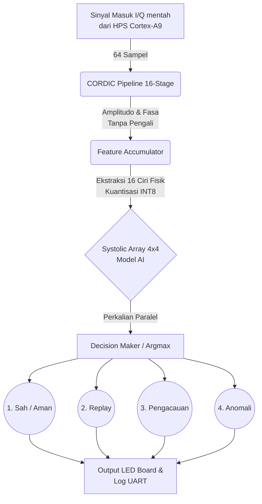

# NiraGuard-8
Akselerator AI INT8 Berbasis Ekstraksi CORDIC untuk Pengamanan Komunikasi Nirkabel Hemat Daya

Repository ini berisi kode RTL (VHDL) dan testbench untuk sistem NiraGuard-8 yang menargetkan board Intel FPGA DE10-Nano (Cyclone V).

## Alur Jalan Konsep Alat

Sistem NiraGuard-8 dirancang untuk melakukan pendeteksian serangan pada sinyal radio (Physical Layer) seperti *Spoofing*, *Replay*, dan *Jamming* secara mandiri (On-Device), cepat, dan hemat daya. 

Berikut adalah visualisasi alur kerjanya:

Berikut adalah rincian tahapan kerjanya:
1. **Penerimaan Sinyal**: Bagian HPS (prosesor ARM Cortex-A9) pada board DE10-Nano menyuplai data sampel sinyal mentah (I/Q) berkecepatan tinggi ke FPGA.
2. **Ekstraksi Sinyal dengan CORDIC**: Gelombang sinyal I/Q mentah kemudian dimasukkan ke modul **CORDIC Pipeline 16-stage** (`cordic_stage.vhd`). Modul ini menghitung amplitudo dan fasa dari gelombang *tanpa menggunakan komponen pengali sama sekali* (zero multipliers), hanya memanfaatkan operasi tambah (add) dan geser (shift).
3. **Perangkuman Ciri (Feature Extraction)**: Output CORDIC dilanjutkan ke modul **Feature Accumulator** (`feature_accumulator.vhd`) yang merangkum 64 sampel sinyal menjadi 16 ciri fisik (seperti fluktuasi puncak, pergeseran frekuensi, jitter fasa, daya rata-rata) dengan skala terkuantisasi INT8.
4. **Pemrosesan AI pada Systolic Array**: 16 Ciri fisik tersebut diproses secara paralel oleh otak AI mini, yaitu kisi hitung **Systolic Array 4×4** (`pe.vhd`). Proses inferensi (perkalian dan akumulasi bobot) dilakukan dengan cepat tanpa membocorkan data keluar dari chip.
5. **Keputusan Akhir (Decision Maker)**: Nilai tertinggi (Argmax) diambil dari hasil jaringan saraf untuk mengkategorikan sinyal ke dalam salah satu dari 4 kelas (Sah, Replay, Pengacauan, Anomali).
6. **Indikator**: Keputusan dikirim kembali ke HPS untuk diteruskan ke log UART dan juga secara hardware langsung mengontrol lampu indikator LED pada board DE10-Nano (0: Sah, 1: Replay, 2: Pengacauan, 3: Anomali).

## Isi File:
- `src/cordic_stage.vhd`: Tahapan komputasi CORDIC tanpa pengali (add/shift) untuk pengukuran fasa & amplitudo.
- `src/pe.vhd`: Unit Processing Element (PE) untuk Systolic Array 4x4, mendukung INT8 akumulasi MAC.
- `src/feature_accumulator.vhd`: Pengekstrak ciri fisik (feature extraction) yang merangkum data sinyal CORDIC.
- `tb/tb_cordic.vhd`: Testbench sederhana untuk modul `cordic_stage.vhd`.
- `tb/test_cordic.py` & `tb/Makefile`: Testbench Python berbasis Cocotb untuk perbandingan dengan *golden model*.

## Mengenai Bitstream (.sof / .rbf)
Karena Intel Quartus Prime diperlukan untuk mensintesis dan menghasilkan file bitstream (`.sof` atau `.rbf`) pada perangkat FPGA, kami tidak dapat menyertakan bitstream langsung di repositori ini. 
Silakan buat project di Intel Quartus Prime, impor file `.vhd` di direktori `src/`, assign ke device `Cyclone V (DE10-Nano)`, lalu jalankan proses **Kompilasi** (Compile Design) untuk mendapatkan bitstream akhir Anda.
